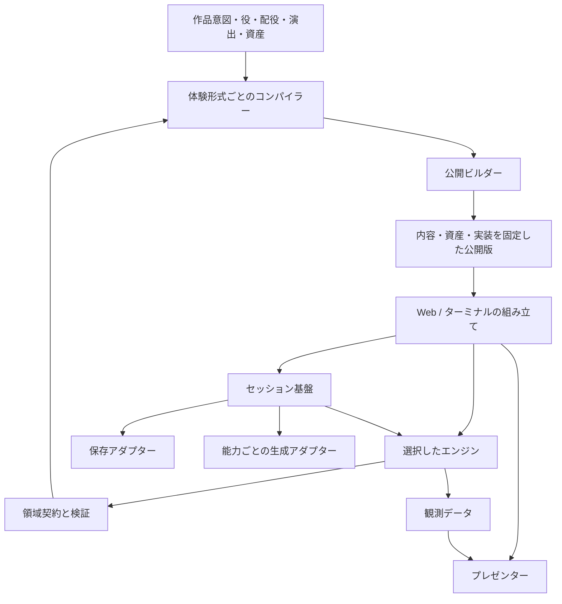

# 実装済みのアーキテクチャ

作品の意味と、その意味を実行・表示・配信する実装を分離する。交換可能性は抽象クラスの数で判断せず、**利用側を変更せずに別実装へ交換できたか**で判断する。

## 境界と依存方向

配線を知るのは組み立て側だけ。基盤のソースは具体的な作品、研究、ミステリー、画面、DBをimportしない。領域契約も外部サービスやDOMに依存しない。

| 所有者 | 所有する意味・判断 |
| --- | --- |
| `foundation/` | 公開版の整合性、実装解決、セッション、操作確定、外部処理の記録 |
| `domains/` | 領域固有の内容・状態・命令の契約と不変条件 |
| `experience-profiles/` | 入力の読み方、領域契約の組合せ、コンパイル |
| `implementations/engines/` | 状態遷移、意味に応じた完了、観測への射影 |
| `implementations/presenters/` | 観測の表示と、宣言された命令の送出 |
| `adapters/` | IndexedDB、SQLite、HTTP、生成器、Python起動 |
| `products/mystery-prince/` | ブランドの制作条件、作品一覧、実装の組立て |
| `research/` と研究領域 | 研究版の編集、割当て、回答、分析 |

## 正本

キャラクターの定義は `domains/characters/assets/`、作品の意図は各作品の `intent.json` に置く。作品固有の役は `roles.json`、出演者と立ち絵の割当ては `casting.json`。ルールは `rules.json`、台詞と証拠の説明文は `performances/ja.json` に置く。

演出文の `{{role:physician.name}}` は公開時に配役へ束縛する。役のIDや真相を変えず、表示名・立ち絵を交換できる。演技の説得力は、新配役用の演出として人が評価する。

`realizations.json` は制作入力と体験形式の選択を記述する。単一の汎用Experienceスキーマへ全作品を変換しない。

## 異なる2つの体験形式

**authored-mystery/1** は、順序を持つ脚本・証拠の取得・仮説評価・指名・終幕を定義する。誤った仮説は再考でき、終幕の操作で完了する。現在の形式は直線的な脚本を対象とし、循環・未到達ノードを拒否する。

**generated-inquiry/1** は公開時点で完成した事件を持たない。初期化時に `case.generate/1` から矛盾のない事件を取得し、結果を記録する。質問し、疑いを何度でも変更・撤回できる。記録と鍵を確認してから一度だけ結論する。正しい結論も誤った結論も、取り消せない完了として成立する。

基盤はどちらの状態フィールドや勝利条件も知らない。

## 公開版と実行

公開版IDは正規化JSONのSHA-256。内容、配役、権限、実装記述、資産ハッシュを含む。エンジンと対応プレゼンターは、推移的なソース依存と依存ロックのハッシュで固定する。Python実装では別言語の本体、Webプレゼンターではスタイルも含める。実行基盤自体は `session/1` 契約に従う。

ホストは公開版IDと実装ハッシュが一致するセッションだけを開く。変更した公開版へ旧セーブを暗黙に付け替えない。研究定義も、対象公開版IDと実行・表示のソース依存を含めてハッシュを固定する。画面・研究制御・基盤の変更でも新しい研究revisionになる。

整合性のハッシュは署名や認可を代用しない。Webは公開版全体を取得するオフライン指向の実行であり、配信JSONを調べれば固定脚本の正解を読める。プレゼンターへ渡す観測データでは未開示の真相を除く。サーバーだけが真相を持つ体験は、その実行境界を別途実装する。

## 保存と外部処理

命令はリビジョンを指定し、保存先のcompare-and-swapで開始・確定する。同じIDの同じ命令は保存済みの結果を返す。別命令によるID再利用は拒否する。進行・完了の正本はチェックポイントであり、分析用イベントから再構成しない。

外部処理の前にpending命令を永続化する。`sessionId/commandId/callIndex` を冪等性キーとして渡し、取得結果を記録してから遷移を確定する。中断時は同じキーと保存済みの結果で再開する。公開版が許可し、エンジンが宣言した能力だけを呼べる。

保証するのはセッション内の一回の確定。外部アダプターにも、同じキーの再送を同一操作として扱う実装が必要になる。現在の2生成器は入力から決定的に生成する。

完成済みの状態と操作履歴を保存する。全面的なイベントソーシング、汎用ワークフロー言語、DIコンテナー、マイクロサービス分割は導入していない。既に交換した境界を維持し、不要な共通化を増やさない。

## 実証

- 固定脚本4公開版を独立したJavaScript/Python実装で誤答を含めて完了し、状態・観測・イベントを比較する。
- 同じ保存契約をMemory/SQLite/実ブラウザーのIndexedDBで検証する。
- 途中のセーブをWeb→ターミナル→別ブラウザーへ移し、続きから完了する。
- 対話型エンジンへ2生成器を接続し、種による真相の変化と両方の結末を検証する。
- コンパイル済みルールを保ちながら、配役名と立ち絵を交換する。

差し替えは契約を満たす信頼済み実装を明示的に登録して行う。任意の外部コードを実行するプラグイン市場や、未信頼コードのサンドボックスは実装していない。
